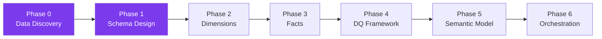
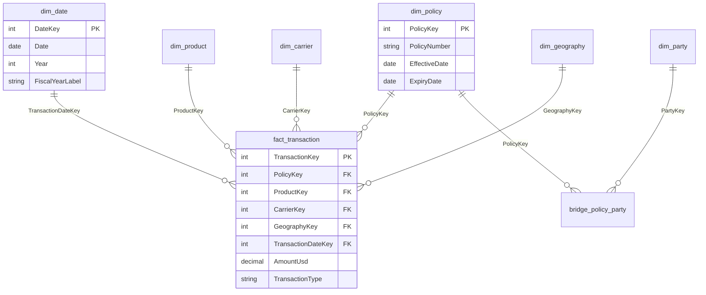

# Global Loom — Gold Layer Project Plan

## Project Overview

| Field | Value |
|---|---|
| **Project** | Global Loom |
| **Source System** | PAS (Policy Administration System) |
| **Fabric Lakehouse** | `The_Global_Loom` |
| **Architecture** | Medallion (Bronze → Silver → Gold) |
| **Gold Layer Pattern** | Star Schema (Dimensional Model) |
| **Consumers** | Power BI (Direct Lake) + AI Agent |
| **Ref Table Prefix** | `ref_pas_` |
| **Column Naming** | PascalCase (`PolicyNumber`, `CarrierKey`) |

---

## Source Data Inventory

### Reference Schema (`ref`) — 4 tables

| Table | Likely Role | Hypothesised Gold Target |
|---|---|---|
| `CarrierHierarchy` | Carrier/insurer hierarchy | `dim_carrier` |
| `FinancialGeographyHierarchy` | Geography hierarchy | `dim_geography` |
| `FinancialSegmentHierarchy` | Business segment hierarchy | `dim_financial_segment` |
| `IndustryHierarchy` | Industry classification | `dim_industry` |

### Report Schema (`rpt`) — 14 tables

| Table | Likely Role | Hypothesised Gold Target |
|---|---|---|
| `vwTransaction` | Main transaction data (4M+ rows) | `fact_transaction` |
| `vwTransactionDetailUSD` | Transaction line details (USD) | `fact_transaction_detail` |
| `vwTransactionSummaryUSD` | Aggregated summary | `agg_transaction_summary` |
| `vwPolicy` | Policy master data | `dim_policy` |
| `vwPolicyLayer` | Coverage layers per policy | Extends `dim_policy` or `fact_policy_layer` |
| `vwPolicyPartyRole` | Policy ↔ Party role mapping | `bridge_policy_party` |
| `vwProduct` | Product catalogue | `dim_product` |
| `vwParty` | Party master (clients, brokers, etc.) | `dim_party` |
| `vwCFParty` | Cash flow party data | Extends `dim_party` |
| `vwAddress` | Address records | Extends `dim_party` or standalone `dim_address` |
| `vwFinancialGeography` | Financial geography detail | `dim_geography` (merge with ref) |
| `vwCarrierHierarchy` | Carrier detail (rpt version) | `dim_carrier` (merge with ref) |
| `vwCFInvoice` | Cash flow invoices | `fact_invoice` or extends fact |
| `vwDataSourceInstance` | Data source metadata | `ref_pas_data_source` (metadata only) |

> [!NOTE]
> The `ref` hierarchy tables and their `rpt` counterparts (e.g., `CarrierHierarchy` vs `vwCarrierHierarchy`) may overlap. The exploration notebook will clarify whether they should be merged or kept separate.

---

## Phased Approach



### Phase 0: Data Discovery & Profiling ← **CURRENT**

**Goal**: Understand every table's schema, grain, quality, and relationships before designing anything.

**Deliverable**: [00_explore_pas_silver.ipynb](file:///c:/Users/LiuPr/OneDrive%20-%20Willis%20Towers%20Watson/Documents/WTW-Data-Solutions/Transformers/Global-Loom/00_explore_pas_silver.ipynb)

**Steps**:
1. Run the exploration notebook in Fabric (attached to `The_Global_Loom`)
2. Review outputs — especially schemas, row counts, shared columns, and transaction deep dive
3. Share profiling summary (not raw data) with AI assistant
4. Answer the 5 decision points (see below)

**Decision Points After Exploration**:

| # | Question | Why It Matters |
|---|----------|---------------|
| 1 | What does one row represent in each transaction table? | Defines the **grain** of the fact table |
| 2 | Which transaction table is the primary fact? | `vwTransaction` vs `vwTransactionDetailUSD` vs `vwTransactionSummaryUSD` |
| 3 | How does `vwPolicyPartyRole` link policies to parties? | Determines if we need a **bridge table** |
| 4 | Do `ref` hierarchy tables duplicate `rpt` views? | Avoid redundant dimensions |
| 5 | Which date columns exist and need role-playing? | Drives `Dim_Date` design and relationships |

---

### Phase 1: Star Schema Design

**Goal**: Design the gold layer star schema based on profiling results.

**Deliverables**:
- ERD diagram (Mermaid)
- Table-level documentation (grain, columns, keys, source)
- FK relationship map

**Hypothesised Star Schema** (to be validated after Phase 0):



> [!IMPORTANT]
> This schema is a **hypothesis**. It will be revised after Phase 0 profiling reveals the actual column names, grains, and relationships.

---

### Phase 2: Build Dimension Tables

**Goal**: Create gold-layer dimension tables. Build in dependency order (shared dims first).

**Notebook Sequence** (one per dimension):

| Order | Notebook | Source Table(s) | Gold Table |
|---|---|---|---|
| 1 | `03_gold_dim_date.ipynb` | Generated | `dim_date` |
| 2 | `03_gold_dim_carrier.ipynb` | `CarrierHierarchy` + `vwCarrierHierarchy` | `dim_carrier` |
| 3 | `03_gold_dim_geography.ipynb` | `FinancialGeographyHierarchy` + `vwFinancialGeography` | `dim_geography` |
| 4 | `03_gold_dim_product.ipynb` | `vwProduct` | `dim_product` |
| 5 | `03_gold_dim_party.ipynb` | `vwParty` + `vwCFParty` + `vwAddress` | `dim_party` |
| 6 | `03_gold_dim_policy.ipynb` | `vwPolicy` + `vwPolicyLayer` | `dim_policy` |
| 7 | `03_gold_dim_financial_segment.ipynb` | `FinancialSegmentHierarchy` | `dim_financial_segment` |
| 8 | `03_gold_dim_industry.ipynb` | `IndustryHierarchy` | `dim_industry` |

**Each notebook follows this structure**:
1. **Markdown**: Purpose, source, grain
2. **Cell 1**: Setup & config
3. **Cell 2**: Read silver source(s) + schema check
4. **Cell 3**: Transform (clean, join, derive, rename to PascalCase)
5. **Cell 4**: Add surrogate key (`[Entity]Key`)
6. **Cell 5**: Data quality checks (null counts, duplicate keys, row counts)
7. **Cell 6**: Write to gold (`dim_[entity]`)

---

### Phase 3: Build Fact Tables

**Goal**: Create gold-layer fact tables with FK references to dimensions.

| Notebook | Source | Gold Table |
|---|---|---|
| `03_gold_fact_transaction.ipynb` | `vwTransaction` or `vwTransactionDetailUSD` | `fact_transaction` |
| `03_gold_bridge_policy_party.ipynb` | `vwPolicyPartyRole` | `bridge_policy_party` |
| `03_gold_fact_invoice.ipynb` (if needed) | `vwCFInvoice` | `fact_invoice` |

**Each fact notebook follows this structure**:
1. **Markdown**: Purpose, grain, source
2. **Cell 1**: Setup & config
3. **Cell 2**: Read silver source(s) + schema check
4. **Cell 3**: Read dimension key mappings (for FK lookups)
5. **Cell 4**: Transform (clean, derive calculated columns)
6. **Cell 5**: FK lookups (join to dims, pick up surrogate keys)
7. **Cell 6**: Final select with PascalCase aliases + explicit `.cast()`
8. **Cell 7**: Data quality checks (orphan keys, null FKs, row counts, sum validation)
9. **Cell 8**: Write to gold (`fact_[process]`)

---

### Phase 4: Data Quality Framework

**Standard DQ checks at the end of every notebook**:

```python
# Row count
print(f"Row count: {df.count():,}")

# Null counts for key columns
for col_name in key_columns:
    null_count = df.filter(F.col(col_name).isNull()).count()
    print(f"  {col_name} nulls: {null_count:,}")

# Orphan key detection (FK exists in fact but not in dim)
orphans = df_fact.join(df_dim, "DimKey", "left_anti")
print(f"  Orphan keys: {orphans.count():,}")

# Duplicate surrogate key check (dims only)
dupes = df.groupBy("EntityKey").count().filter(F.col("count") > 1)
print(f"  Duplicate keys: {dupes.count():,}")
```

---

### Phase 5: Semantic Model (Power BI)

> Not ready at this stage. Will be designed after gold layer is built.

**Preliminary plan**:
- Direct Lake semantic model over gold Delta tables
- `Dim_Date` with Australian FY (Jul–Jun) as per existing template
- Role-playing date relationships via `USERELATIONSHIP()`
- Measure library following WTW DAX patterns

---

### Phase 6: Orchestration

> Not ready at this stage.

**Preliminary plan**:
- Fabric Pipeline to orchestrate notebook execution
- Dependency order: Dimensions → Facts → Aggregations
- Scheduled daily refresh
- Error alerting

---

## Standards & Conventions

### File Naming

| Type | Pattern | Example |
|---|---|---|
| Exploration | `00_explore_[subject].ipynb` | `00_explore_pas_silver.ipynb` |
| Gold Dimension | `03_gold_dim_[entity].ipynb` | `03_gold_dim_carrier.ipynb` |
| Gold Fact | `03_gold_fact_[process].ipynb` | `03_gold_fact_transaction.ipynb` |
| Gold Bridge | `03_gold_bridge_[relationship].ipynb` | `03_gold_bridge_policy_party.ipynb` |
| Gold Aggregate | `03_gold_agg_[metric].ipynb` | `03_gold_agg_monthly_premium.ipynb` |

### Table Naming

| Layer | Prefix | Example |
|---|---|---|
| Silver (source) | As-is from PAS | `vwTransaction`, `CarrierHierarchy` |
| Gold Fact | `fact_` | `fact_transaction` |
| Gold Dimension | `dim_` | `dim_policy`, `dim_carrier` |
| Gold Bridge | `bridge_` | `bridge_policy_party` |
| Gold Aggregate | `agg_` | `agg_monthly_premium` |
| Reference | `ref_pas_` | `ref_pas_currency_mapping` |

### Column Naming

- **PascalCase** for all gold layer columns: `PolicyNumber`, `TransactionDate`, `AmountUsd`
- **Surrogate keys**: `[Entity]Key` — e.g., `PolicyKey`, `CarrierKey`, `TransactionKey`
- **Date keys**: `[Role]DateKey` — e.g., `TransactionDateKey`, `EffectiveDateKey`
- **DateKey format**: `YYYYMMDD` integer (e.g., `20251106`)

### Write Pattern

```python
df.write.format("delta").mode("overwrite").option("overwriteSchema", "true").saveAsTable(f"{LAKEHOUSE}.{TABLE_NAME}")
```

### Notebook Idempotency

All notebooks use `mode("overwrite")` + `overwriteSchema` — safe to re-run at any time.

---

## Project Folder Structure

```
Transformers/Global-Loom/
├── README.md                              # This plan
├── 00_explore_pas_silver.ipynb            # Phase 0: Data profiling
├── 03_gold_dim_date.ipynb                 # Phase 2: Dimensions
├── 03_gold_dim_carrier.ipynb
├── 03_gold_dim_geography.ipynb
├── 03_gold_dim_product.ipynb
├── 03_gold_dim_party.ipynb
├── 03_gold_dim_policy.ipynb
├── 03_gold_fact_transaction.ipynb         # Phase 3: Facts
├── 03_gold_bridge_policy_party.ipynb
└── ...
```
